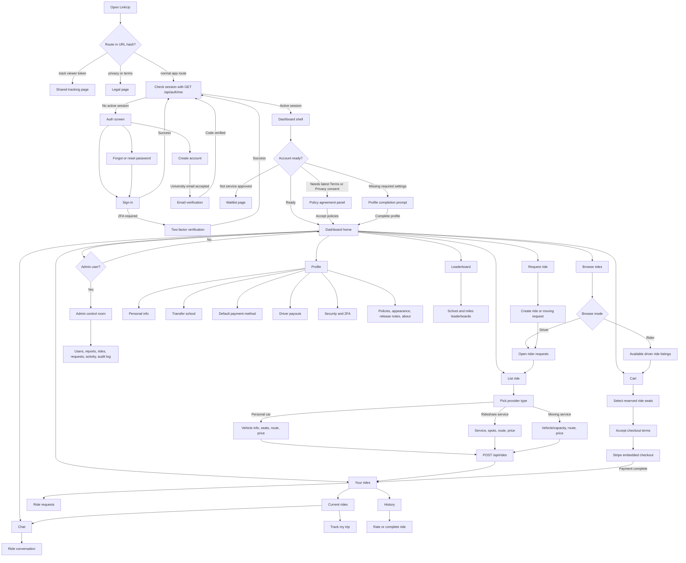
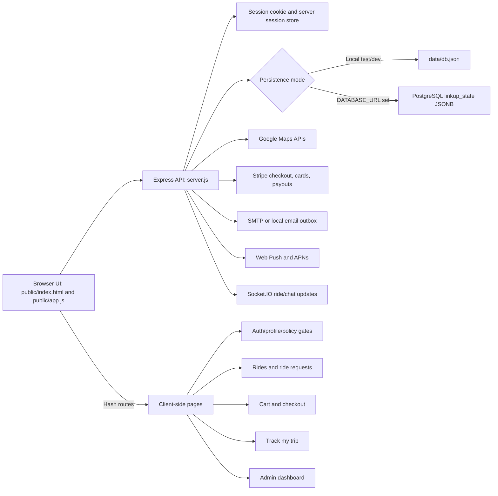
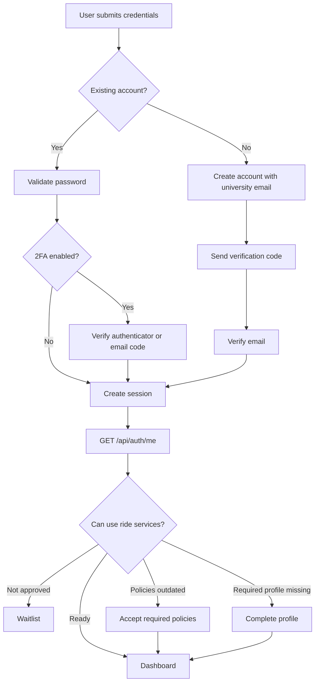
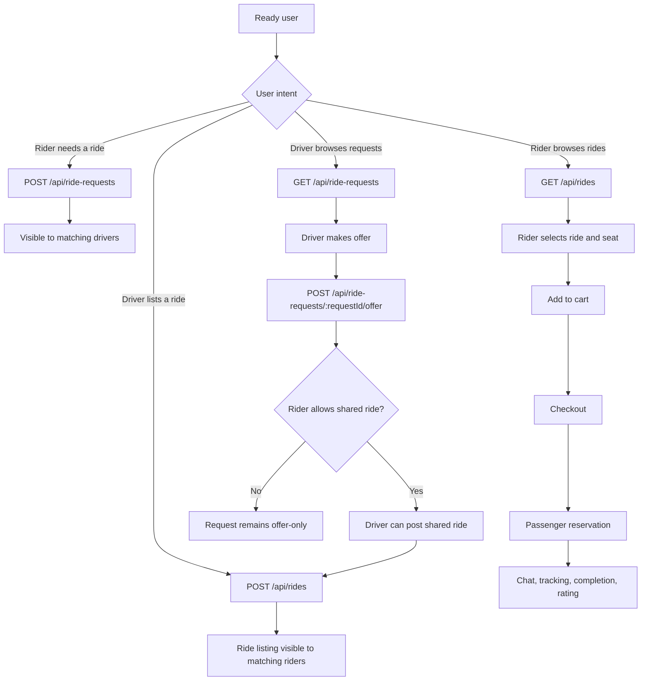
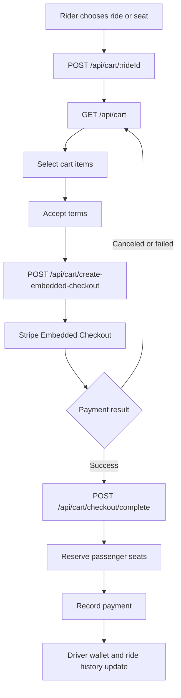
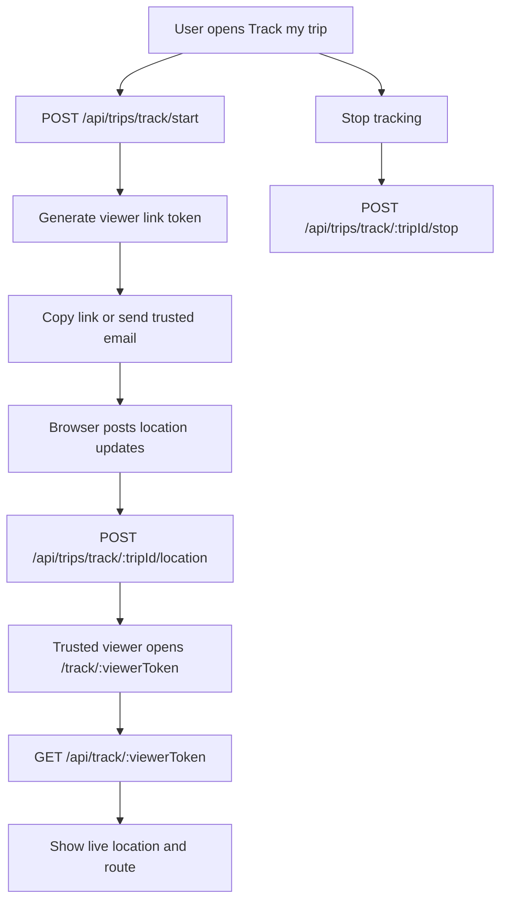
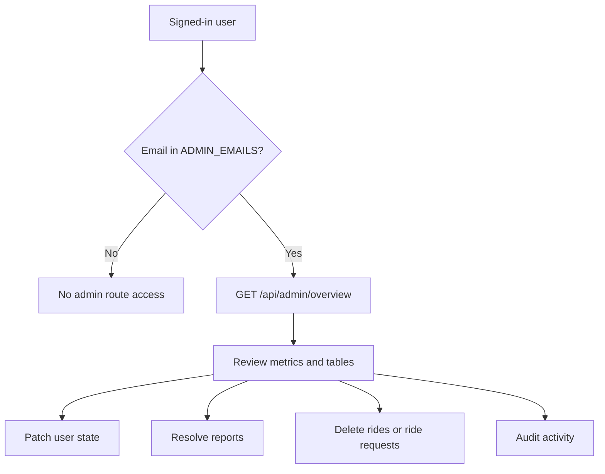

# LinkUp app flow chart

This file documents the main LinkUp web-app flow. The diagrams use Mermaid, so they render directly in GitHub and most Markdown previewers.

## Main user flow

## Backend and data flow

## Auth and access gates

## Ride marketplace flow

## Cart and payment flow

## Trip tracking flow

## Admin flow

