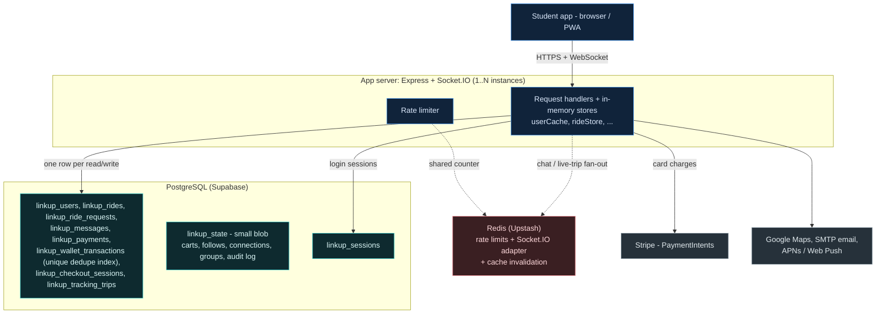
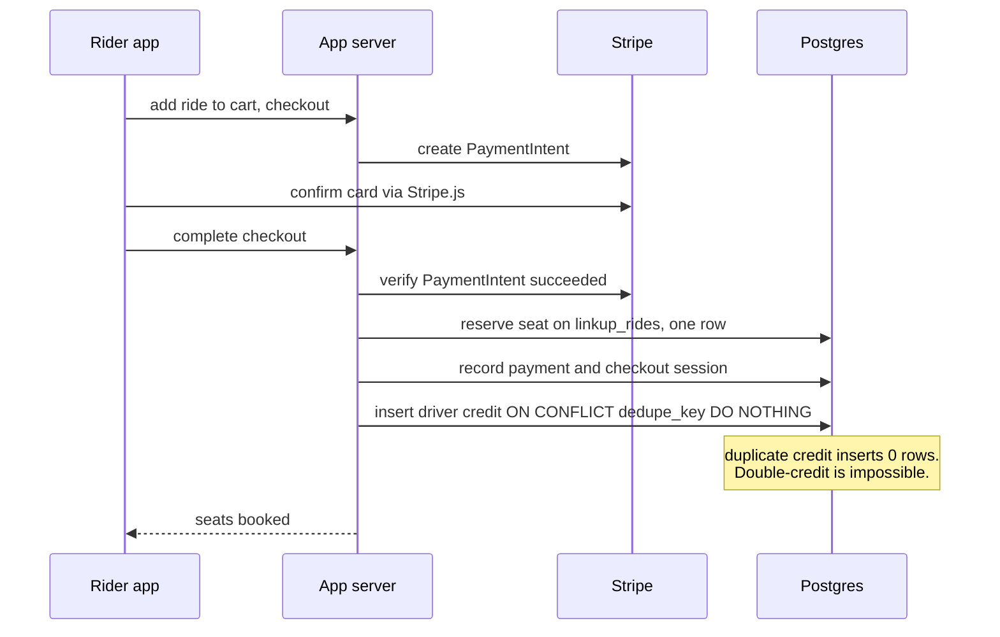
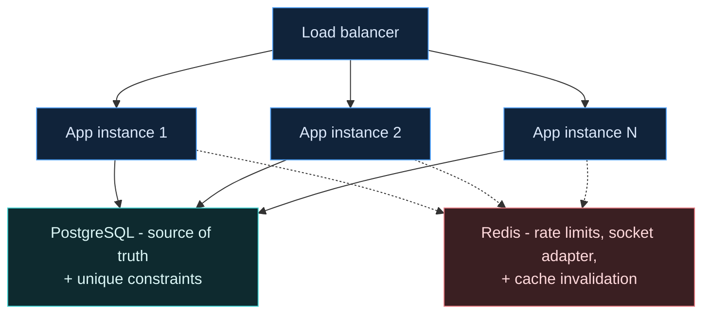

# LinkUp — System Architecture

How the pieces connect: N app servers talking to per-entity Postgres tables,
Redis for shared limits, real-time fan-out, and cross-instance cache coherence,
and Stripe for money. Companion to [scalability.md](scalability.md). (Diagrams
render on GitHub and any Mermaid viewer.)

**Status (PR #5, 2026-07-19):** storage migrated to per-row tables · Redis
rate-limit + socket adapter live · DB-enforced money idempotency · **cross-instance
cache invalidation live — horizontally scalable (N instances with `REDIS_URL`
set), verified on production's codebase with two live instances (9/9) + a full
Stripe-test checkout (12/12).** Not yet deployed; single-instance until
`APP_INSTANCE_COUNT>1` is set.

## 1. The system today

Each app instance (one is fine for a pilot; N is supported) handles requests the
same way. Each data type lives in its own indexed Postgres table (a write touches
one row); the tiny `linkup_state` blob only holds low-traffic collections. Redis
carries shared rate limits, socket fan-out, and cache invalidation; the external
services hang off the app.

## 2. What each store holds

The migration moved every high-write, unbounded entity out of the single blob.
A location ping, a chat message, or a checkout now writes exactly one row.

| Table | Holds | Why it's here |
| --- | --- | --- |
| `linkup_users` | Accounts, profiles, 2FA, payout info | Persisted by change-detection on save; email indexed |
| `linkup_rides` | Ride listings + passengers | Create / join / complete each touch one row |
| `linkup_ride_requests` | "Looking for a ride" posts | Post / offer / expire independently |
| `linkup_messages` | Ride, social & club chat | Append-only; one row per message |
| `linkup_payments` | Completed payments | Read by `reconcile` + `metrics` scripts |
| `linkup_wallet_transactions` | Driver earnings & debits ledger | **Partial `UNIQUE` index on a dedupe key — the DB rejects a duplicate credit** |
| `linkup_checkout_sessions` | In-flight & completed checkouts | Status transitions per row |
| `linkup_tracking_trips` | Live-trip GPS trails | Highest-frequency write; retention-purged |
| `linkup_state` | Carts, follows, connections, groups, audit log | Small, low-traffic — fine as one blob for now |
| `linkup_sessions` | Login sessions | Already shared — works across instances |

## 3. A checkout, end to end

The money path is the most safety-critical. Seat reservation and the driver
credit are both idempotent — the second is enforced by the database itself.

## 4. Scaling status — all five pieces done

Every scaling piece is done and verified against real Postgres, Stripe (test),
and Redis (Upstash). The app is horizontally scalable.

- **✓ Per-row storage** — writes touch one row, not the whole database. The
  4ms→245ms-at-20k-users write ceiling is gone.
- **✓ Shared rate limiting** — two instances behind one Redis enforce a single
  combined limit; falls back to in-memory if Redis is down.
- **✓ Socket.IO Redis adapter** — chat & live-trip events fan out across
  instances via Redis pub/sub.
- **✓ DB-enforced money safety** — a partial `UNIQUE` index makes a duplicate
  driver credit impossible, even if two servers race the same checkout.
- **✓ Cross-instance cache coherence** — every committed write publishes a
  `{from, kind, key}` message on the Redis channel `linkup:invalidate`; the other
  instances reload just that row (or the small blob) from Postgres. Publishes are
  chained after the DB commit, and each instance ignores its own messages by
  origin id. *Verified with two live instances:* a user, ride, and chat message
  created on A appeared on B in ~300–600ms, and a profile edit on B propagated
  back to A. The `APP_INSTANCE_COUNT` guard now permits N instances when
  `REDIS_URL` is set.

## 5. The target, now the shape: many servers

A load balancer over N identical app instances, all sharing the same Postgres
(the source of truth, with unique constraints) and Redis (limits, socket
fan-out, and cache invalidation). Sessions and socket fan-out are both shared, so
no sticky sessions are needed. Set `REDIS_URL`, then `APP_INSTANCE_COUNT` (with
`DATABASE_POOL_MAX` sized so their product fits the database).

_Verified against a throwaway Supabase Postgres, Stripe test mode, and Upstash
Redis. Diagrams validated with Mermaid v11._
